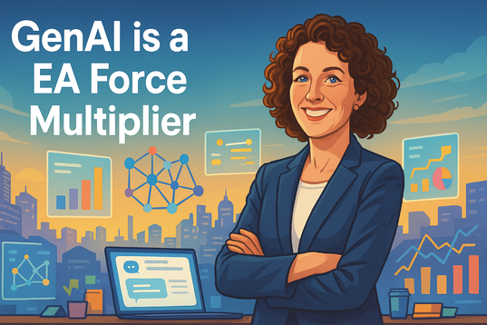
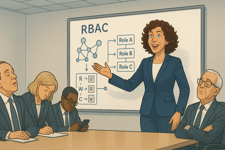
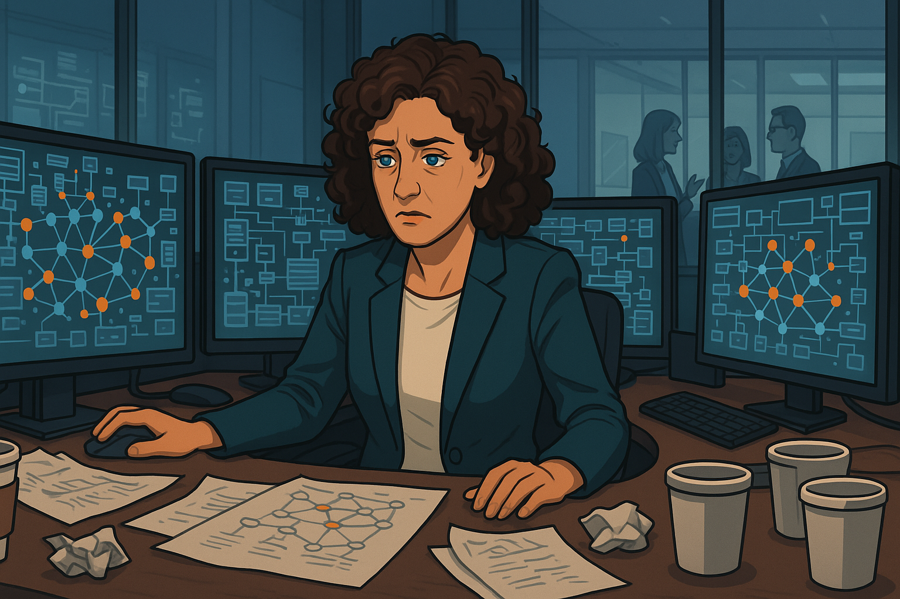
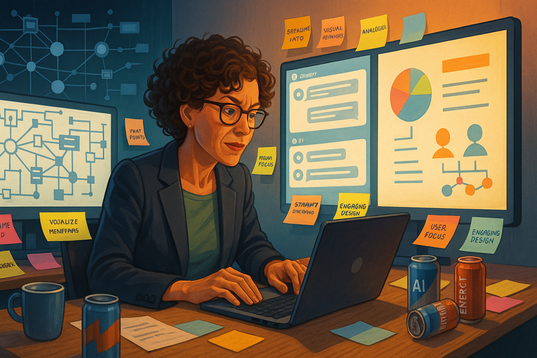
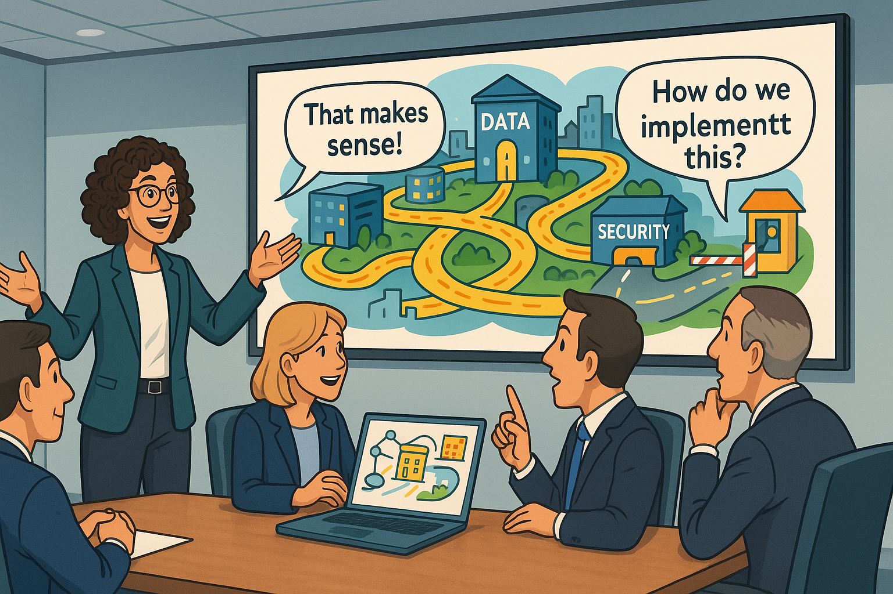
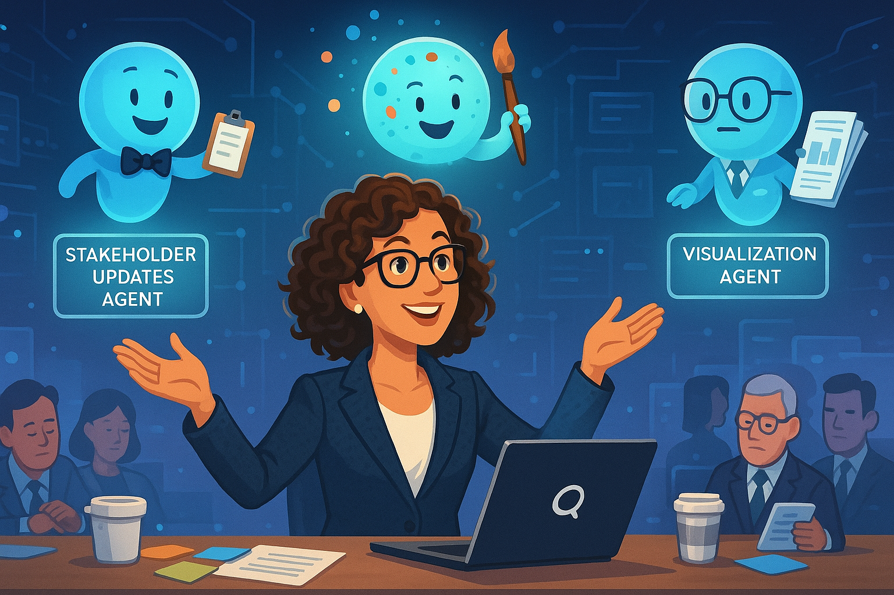
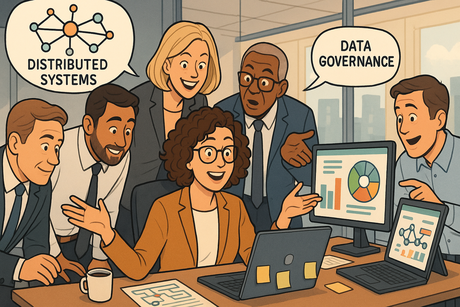
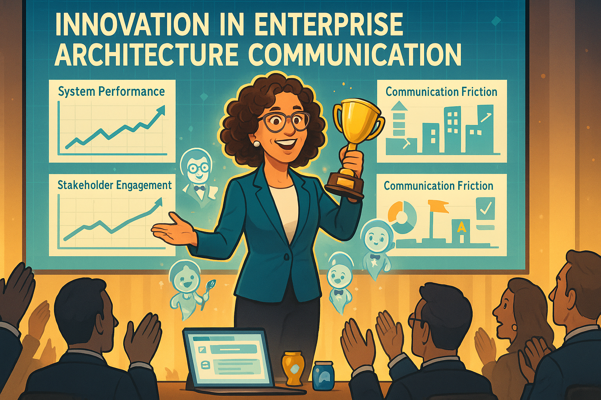
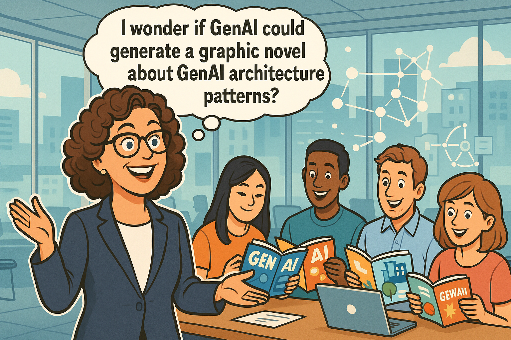

# Generative AI Becomes a Force Multiplier for an Enterprise Architect

## Panel 1: The Data Whisperer

   
Lynda's Mind Palace

   Lynda Carver is a 45 year old enterprise architect with curly brown hair and bright blue eyes.  She is a sharp dresser and always wears stylish outfits.  She stands in the center of a glowing digital landscape, her arms outstretched as streams of colorful data flow around her like ribbons. Behind her, a massive knowledge graph pulses with interconnected nodes, while servers, databases, and network components float in organized clusters. Her expression is one of pure joy and understanding as she conducts this symphony of enterprise architecture.

Meet Lynda Carver, the enterprise architect who sees data flows the way Mozart heard symphonies. While her colleagues squint at boring PowerPoint diagrams, Lynda visualizes enterprise systems as living, breathing ecosystems. "Beautiful, isn't it?" she whispers to herself, watching terabytes of customer data dance through her perfectly orchestrated knowledge graph. Little does she know that her greatest challenge isn't technical—it's getting anyone else to see what she sees.

## Panel 2: The Blank Stare Brigade

   
Conference Room of Confusion

   Panel 2: 
   Please generate a wide-format landscape drawing with a width:height ratio of 16:9.
   Make the image of Lynda Carver consistent with the prior image.
   A sterile conference room with Lynda presenting enthusiastically at a whiteboard covered in complex network diagrams and knowledge graph structures. The executives around the table have glazed expressions, some checking phones, others doodling. One person is clearly asleep. Lynda 's diagram shows RBAC at the node level with roles and their read/write permissions, but everyone looks completely lost.

"And THAT'S why we need role-based access control at the graph node level!" Lynda declares triumphantly, gesturing at her masterpiece of interconnected security layers. The executive committee stares back with the enthusiasm of people watching paint dry in slow motion. "Any questions?" she asks hopefully. The CFO raises his hand: "Yeah, can we just buy something off the shelf instead?" Lynda 's eye twitches slightly. *These people wouldn't recognize elegant architecture if it sent them a personalized birthday card,* she thinks.

## Panel 3: The Isolation Station

   
Lynda 's Lonely Cubicle Kingdom

   Panel 3
   Please generate a wide-format landscape drawing with a width:height ratio of 16:9.
   Make the characters consist with prior panels.
   Lynda sits alone at her desk, surrounded by multiple monitors displaying complex system architectures. Empty coffee cups and crumpled papers litter her workspace. Through the office windows, she can see other employees chatting and collaborating, but she's isolated in her technical fortress. Her screens show beautiful knowledge graphs that nobody else understands.

Back at her desk, Lynda stares at her monitors displaying the most elegant enterprise architecture anyone has ever conceived. "It's like trying to explain quantum physics to a goldfish," she mutters, adding another layer of security protocols to her already-perfect system. Her knowledge graphs could revolutionize how the company handles data, but she might as well be speaking ancient Sumerian for all the traction she's getting. The irony isn't lost on her—she's built the perfect communication infrastructure for an organization that can't communicate with her.

## Panel 4: The Lightning Bolt Moment

   
The ChatGPT Epiphany

   Panel 4
   Please generate a wide-format landscape drawing with a width:height ratio of 16:9.
   Make the characters consist with prior panels.
   Lynda 's face is illuminated by her laptop screen showing a ChatGPT interface. Above her head, a massive lightbulb glows with electric energy, and her expression shows sudden understanding. Around her, holographic representations of her complex diagrams begin transforming into simpler, more engaging visual metaphors. The background shows the transformation from technical complexity to accessible communication.

At 2:47 AM on a Tuesday (because that's when all good ideas happen), Lynda discovers GenAI can translate her architect-speak into human language. "Wait... you mean I can turn my 'distributed microservices with event-driven architecture' into 'imagine your company data as a smart city where information flows like traffic'?" The possibilities explode in her mind like digital fireworks. For the first time in years, Lynda Carver —- master of complex systems —- allows herself to smile. The machines might finally help her talk to the humans.

## Panel 5: The Great Translation Project

   
Lynda 's AI-Powered Workshop

   Panel 5:
   Please generate a wide-format landscape drawing with a width:height ratio of 16:9.
   Make the characters consist with prior panels.
   Lynda works intensely at her computer, multiple AI chat windows open alongside her technical diagrams. Colorful sticky notes cover her monitors with prompts and ideas. The scene shows her technical drawings on one side transforming through AI assistance into engaging presentations, infographics, and simple analogies on the other side. Coffee cups and energy drink cans suggest she's been at this for hours.

Lynda becomes a prompt engineering wizard overnight. "Create an analogy comparing enterprise data governance to a well-run restaurant kitCarver ," she types, grinning as the AI spits out gold: "Just like a head chef controls who can access the walk-in freezer, your data needs role-based permissions at every level." She's discovered that generative AI isn't just a tool—it's her personal translation service from "architectural genius" to "something the C-suite might actually understand." *Who knew the secret to enterprise architecture success was learning to speak CFO?*

## Panel 6: The Presentation Phoenix

   
The New and Improved Lynda 

   Panel 6
   Please generate a wide-format landscape drawing with a width:height ratio of 16:9.
   Make the characters consist with prior panels.
   The same conference room as Panel 2, but transformed. Lynda presents with confidence using engaging visual metaphors on the screen—her knowledge graph is now depicted as a smart city with data highways and security checkpoints. The executives are leaning forward, engaged and asking questions. Speech bubbles show them using phrases like "That makes sense!" and "How do we implement this?"

Two weeks later, Lynda stands before the same executive committee, but this time her presentation features animated data flowing through a digital metropolis instead of incomprehensible network diagrams. "Think of RBAC as having different key cards for different floors of a building," she explains, watching their faces light up with actual understanding. The CFO—the same guy who wanted to "buy something off the shelf"—is now asking about implementation timelines. *Turns out they weren't idiots after all,* Lynda muses. *They just needed subtitles for my brilliance.*

## Panel 7: The Agent Army Assembly

   
Lynda 's Digital Minions

   Panel 7
   Please generate a wide-format landscape drawing with a width:height ratio of 16:9.
   Make the characters consist with prior panels.
   Lynda sits at her command center surrounded by floating holographic AI agents, each with distinct personalities and functions. One agent wears a bow tie and holds a clipboard (the Stakeholder Updates Agent), another has paint splatters and holds a brush (the Visualization Agent), and a third wears glasses and carries reports (the Analytics Agent). Lynda looks like a conductor orchestrating her digital symphony.

Why stop at better presentations when you can automate the entire communication pipeline? Lynda creates a squadron of AI agents: the Stakeholder Update Bot (charmingly neurotic), the Visual Metaphor Generator (artistically pretentious), and the Executive Summary Simplifier (ruthlessly diplomatic). "From now on," she announces to her digital minions, "you'll keep everyone informed about our architectural improvements using language they actually understand." Her agents salute in unison. Well, metaphorically speaking.

## Panel 8: The Feedback Loop Revolution

   
Interactive Architecture Playground

   Panel 8
   Please generate a wide-format landscape drawing with a width:height ratio of 16:9.
   Make the characters consist with prior panels.
   Lynda 's laptop displays an interactive dashboard with colorful gauges, sliders, and clickable elements representing different aspects of enterprise architecture. Around her, holographic displays show real-time feedback from stakeholders engaging with her interactive tools. Charts and graphs float in the air showing comprehension levels, engagement metrics, and knowledge retention scores.

But Lynda 's masterstroke is the Interactive Architecture Comprehension Dashboard—a gamified interface where her colleagues can drag and drop security policies, adjust data flow parameters, and watch their decisions ripple through the enterprise ecosystem. Color-coded feedback shows who actually gets the concepts versus who's just nodding along. "It's like SimCity for enterprise architecture," she chuckles, watching the Head of Operations actually understand why microservices matter. *Finally, a way to separate the architects from the people who just like drawing boxes.*

## Panel 9: The Resistance Crumbles

   
The Converts

   Panel 9
   Please generate a wide-format landscape drawing with a width:height ratio of 16:9.
   Make the characters consist with prior panels.

   Former skeptics now surround Lynda 's desk, eagerly looking at her monitors and asking questions. The same executives from the early panels are now engaged collaborators, with thought bubbles showing their understanding of concepts like "distributed systems" and "data governance." Lynda looks surprised but pleased by their newfound enthusiasm and comprehension.

The transformation is remarkable. The same executives who once treated Lynda 's presentations like root canals are now volunteering for architecture reviews. "So if we implement this knowledge graph approach," the Marketing Director asks thoughtfully, "we could actually track customer sentiment across all touchpoints?" Lynda nods, trying not to look too smug. The CFO—her former nemesis—actually used the phrase "emergent system properties" correctly in yesterday's budget meeting. *Who would have thought? Give people the right interface, and they suddenly become architectural geniuses.*

## Panel 10: The Scaling Success

   
Lynda 's Empire Expands

   Panel 10
   Please generate a wide-format landscape drawing with a width:height ratio of 16:9.
   Make the characters consist with prior panels.
   A bird's eye view of the entire office building, with Lynda 's influence spreading like digital vines through every department. Screens throughout the building display her interactive dashboards and engaging architectural visualizations. Employees at various workstations are actively using her tools, with satisfaction indicators and engagement metrics floating above their heads.

Six months later, Lynda 's AI-powered communication approach has spread throughout the organization like the world's most useful virus. Every department now has customized architectural dashboards, real-time system health monitors, and those delightfully sarcastic update agents. The IT help desk reports a 73% decrease in "Why is the system so complicated?" tickets. Even the intern in Accounting can explain the difference between synchronous and asynchronous messaging patterns. *I haven't just built better architecture,* Lynda realizes. *I've built better architects.*

## Panel 11: The Recognition Ceremony

   
Lynda 's Moment of Glory

   Panel 11
   Please generate a wide-format landscape drawing with a width:height ratio of 16:9.
   Make the characters consist with prior panels.
   A corporate awards ceremony with Lynda on stage receiving recognition. Behind her, large screens display metrics showing improved system performance, increased stakeholder engagement, and reduced communication friction. The audience is applauding enthusiastically. A banner reads "Innovation in Enterprise Architecture Communication." Lynda holds a trophy while her AI agents appear as small holograms celebrating around her.

The CEO presents Lynda with the "Innovation Excellence Award" as metrics flash on the screen behind her: 400% increase in architectural proposal approvals, 67% reduction in project delays due to miscommunication, and a 89% stakeholder satisfaction rate with technical documentation. "Lynda didn't just improve our architecture," the CEO announces. "She architected better communication itself." As applause fills the auditorium, Lynda 's AI agents flash congratulatory messages on her phone. *Not bad for someone who used to get blank stares when explaining RBAC,* she thinks, allowing herself a moment of well-deserved pride.

## Panel 12: The New Paradigm

   
Lynda 's Legacy

   Panel 12
   Please generate a wide-format landscape drawing with a width:height ratio of 16:9.
   Make the characters consist with prior panels.
   A futuristic office environment where Lynda , now clearly established as a leader, mentors a new generation of enterprise architects. Multiple holographic displays show elegant system designs that everyone can understand. Her mentees are diverse professionals from different backgrounds, all engaged and collaborating effectively. In the background, the enterprise architecture flows like a living, breathing organism that serves both technical excellence and human understanding.

One year later, Lynda leads a new generation of "Communicating Architects"—technical experts who wield generative AI like she once wielded data models. The enterprise runs like a Swiss watch, but more importantly, everyone understands why. Her knowledge graphs have become the nervous system of organizational intelligence, and her AI agents ensure that complex architectural decisions are translated into human wisdom in real-time. "The secret," Lynda tells her mentees, "wasn't making the architecture simpler. It was making the complexity accessible." She grins, watching her latest batch of stakeholder reports generate themselves. *Turns out the best force multiplier for an enterprise architect isn't more powerful servers or fancier databases—it's making sure everyone else can see the symphony too.*

## Epilog

   
Lynda's Graphic Novel

   Panel 13
   Please generate a wide-format landscape drawing with a width:height ratio of 16:9.
   Make the characters consist with prior panels.

   Linda Carver has a brilliant new idea. She has a big smile and an optimistic face.  She has a thought bubble "I wonder if GenAI could generate a graphic novel about GenAI architecture patterns?".  She is surrounded by young engineers reading comic books.

One day Lynda noticed that her staff all loved to read graphic novels.  She wondered if
some day generative AI could generate graphic novels to teach concepts in generative
AI patterns.  Then she realized that would probably never happen.  AI is good at helping
an enterprise architect be more productive, but generating a graphic novel would
be hard.  It might not be possible...unless you were very clever at writing good prompts.

## References

1. [Anthropic Claude Sonnet 4.0 Original Dialog for Narrative](https://claude.ai/share/3577811d-c08b-4d17-867a-4cf896857699)
2. [OpenAI GPT-5 Dialog for Images](https://chatgpt.com/share/68c6e061-4ef8-8001-a63c-d2769eeb22fe)